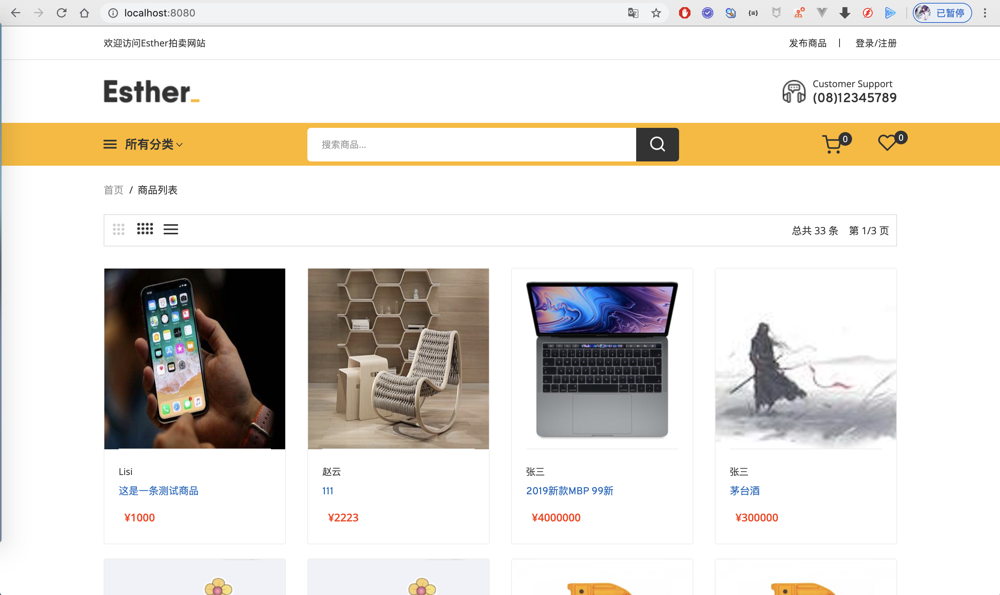
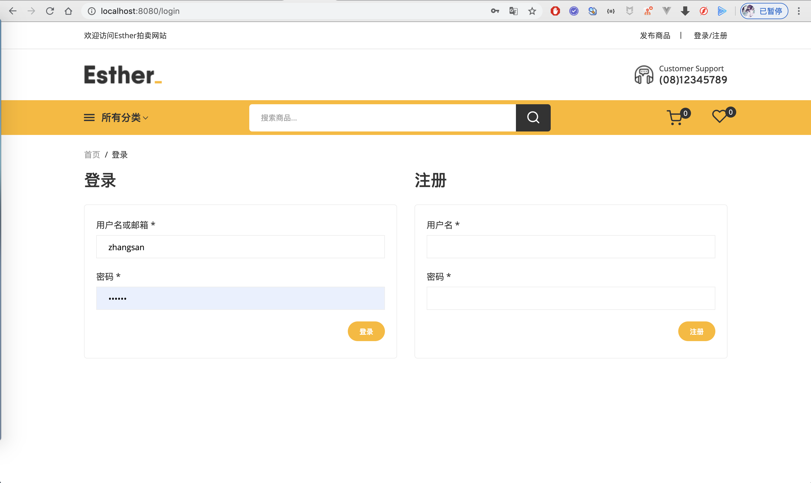
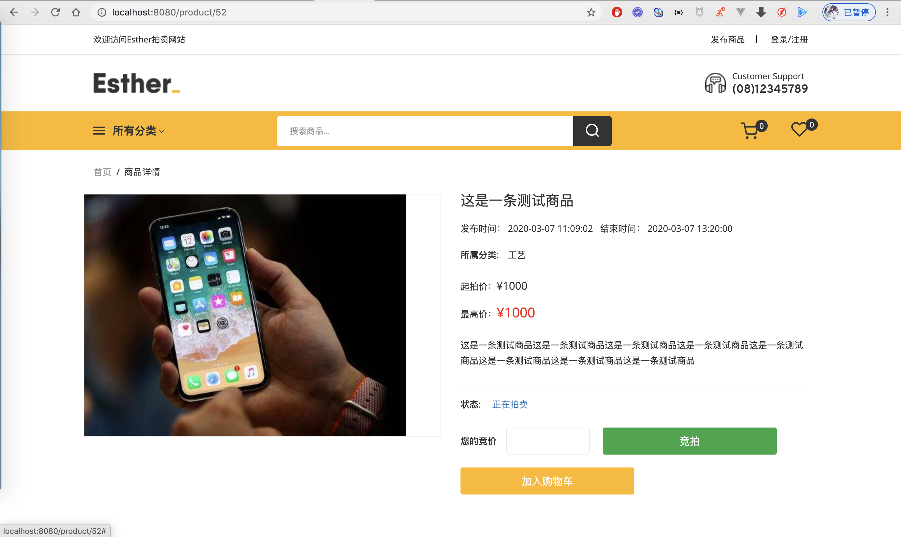
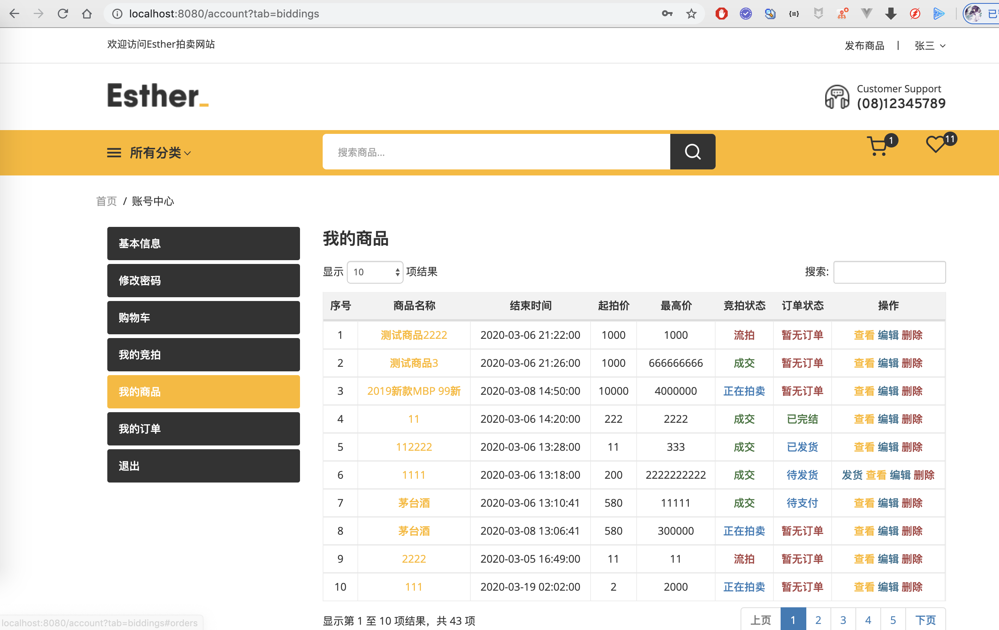
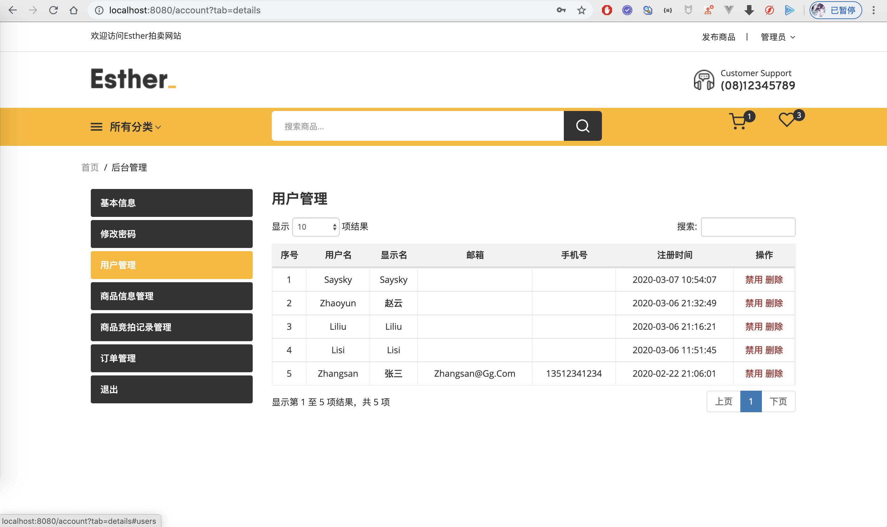

## 博主开发的其他商城项目全部在这里
**[https://liuyanzhao.com/shop.html?k=商城](https://liuyanzhao.com/shop.html?k=商城)**  
- -------------------------------------------------------------------------------
感谢支持正版项目的朋友
# ForestShop
基于 SSM 实现的拍卖系统，包含商品、购物车、竞拍记录、订单等功能，包括普通用户和管理员两种角色，详情可以下载 doc 文件进行查看。 
预览地址：[http://forestshop.liuyanzhao.com/](http://forestshop.liuyanzhao.com)  
详细介绍：[https://liuyanzhao.com/10189.html](https://liuyanzhao.com/10189.html)
## 技术组成
- Java
- Maven 
- MySQL 
- IDEA/Eclipse
- Spring+SpringMVC+MyBatis
- JSP

## 预览
1、 首页列表  
商品列表分页显示，可以根据分类显示，可以根据名称模糊查询。右上角显示购物车商品数量和竞拍中数量。

2、 登录注册

 
 
3、 商品详情  
下面还有竞拍记录列表

4、 商品发布页面  
为了好截图，将浏览器缩写了点。可以上传图片，日期是datepicker插件。

5、 后台购物车列表  

6、 后台商品列表  

7、 后台竞拍列表  

8、 后台订单列表  

9、 管理员后台用户列表  
管理员可以查看所有用户的商品、订单、竞拍和用户信息。

## 联系方式
需要完整代码，联系本人  
微信：847064370
